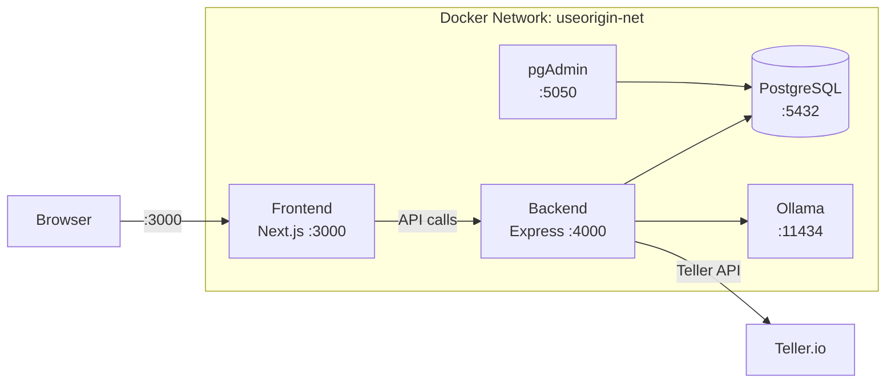

# 💰 UseOrigin

**Self-hosted, zero-cost personal finance & wealth management dashboard for your household.**

All data stays on your local network. No cloud subscriptions. No telemetry. Built with Docker for one-command deployment alongside your existing home server services (Jellyfin, *arr stacks, etc.).

---

## Architecture



| Service | Technology | Purpose |
|---------|-----------|---------|
| **frontend** | Next.js 15, Tailwind CSS, Recharts | Dashboard UI, charts, chat interface |
| **backend** | Node.js, Express, Helmet | API server, Teller integration, business logic |
| **database** | PostgreSQL 16 Alpine | Transaction history, categories, net worth logs |
| **db-admin** | pgAdmin 4 | Optional database browser |
| **llm-engine** | Ollama (Llama 3) | Local AI financial advisor (no data leaves your machine) |

---

## Prerequisites

- **Docker** & **Docker Compose** (v2+)
- **Teller.io Developer Account** — [Sign up free](https://teller.io)
  - Obtain your **Application ID** from the Teller Dashboard
  - Download your **mTLS certificate** (`certificate.pem`) and **private key** (`private_key.pem`)
  - Free developer tier: up to **100 live connections** (supports Chase, BoA, Wells Fargo, etc.)
- **~8 GB RAM** for Ollama (Llama 3 8B); 16 GB+ recommended
- **NVIDIA GPU** (optional) — uncomment the GPU section in `docker-compose.yml` for acceleration

---

## Quick Start

### 1. Clone & Configure

```bash
git clone <your-repo-url> useorigin
cd useorigin

# Create your secrets file from the template
cp .env.example .env
```

Edit `.env` and fill in your real values:

```env
# Required
POSTGRES_PASSWORD=<strong-random-password>
TELLER_APPLICATION_ID=app_XXXXXX
TELLER_ENVIRONMENT=development    # or sandbox for testing
```

If you plan to use pgAdmin, set `PGADMIN_EMAIL` to a valid, non-reserved email-style login such as `admin@useorigin.dev`.

### 2. Add Teller Certificates

Download your mTLS certificate files from the [Teller Dashboard](https://teller.io/dashboard) and place them in the `certs/` directory:

```
certs/
├── certificate.pem
└── private_key.pem
```

> **Note:** For **sandbox** mode, certificates are optional. For **development/production** (real bank connections), they are required.

### 3. Build & Launch

```bash
# Build all images and start in detached mode
docker compose up --build -d

# Watch logs (Ctrl+C to stop watching, containers keep running)
docker compose logs -f
```

### 4. Verify

| Service | URL | Expected |
|---------|-----|----------|
| Frontend | [http://localhost:3000](http://localhost:3000) | Landing page with status indicators |
| Backend Health | [http://localhost:4000/api/health](http://localhost:4000/api/health) | `{ "status": "ok", "database": { "connected": true } }` |
| AI Chat Status | [http://localhost:4000/api/chat/status](http://localhost:4000/api/chat/status) | `no_model` before `ollama pull`, `ready` after the model is installed |
| Teller Config | [http://localhost:4000/api/teller/config](http://localhost:4000/api/teller/config) | `{ "applicationId": "app_...", "environment": "..." }` |
| pgAdmin | [http://localhost:5050](http://localhost:5050) | Login with your `PGADMIN_EMAIL` / `PGADMIN_PASSWORD` |
| Ollama | [http://localhost:11434/api/tags](http://localhost:11434/api/tags) | `{ "models": [] }` |

### 5. Pull an LLM Model

```bash
docker compose exec llm-engine ollama pull llama3
```

Use [http://localhost:4000/api/chat/status](http://localhost:4000/api/chat/status) to confirm when the AI chat endpoint is ready.

---

## Database Schema

Six tables are auto-created on first start via `database/init.sql`:

| Table | Purpose |
|-------|---------|
| `users` | Household members (seeded with Emil & Adelisa) |
| `teller_enrollments` | Teller enrollment tokens and institution info |
| `accounts` | Bank accounts with balance tracking |
| `transactions` | Transaction history with unique constraint on `teller_transaction_id` |
| `assets` | Manual net-worth entries (property, investments, etc.) |
| `categories` | User-defined budget categories with monthly limits |

---

## Project Structure

```
useorigin/
├── docker-compose.yml
├── .env.example
├── .gitignore
├── README.md
│
├── certs/                      # Teller mTLS certificates (git-ignored)
│   ├── README.md
│   ├── certificate.pem         # ← you add this
│   └── private_key.pem         # ← you add this
│
├── frontend/                   # Next.js 15 + Tailwind CSS + Recharts
│   ├── Dockerfile
│   └── src/app/
│       ├── layout.tsx
│       ├── globals.css
│       └── page.tsx
│
├── backend/                    # Express API server
│   ├── Dockerfile
│   ├── package.json
│   └── src/
│       ├── index.js
│       ├── db.js
│       ├── tellerClient.js
│       └── routes/
│           ├── teller.js       # Enrollment + transaction sync
│           ├── transactions.js # Query + category override
│           └── accounts.js     # Account listing + balances
│
├── database/
│   └── init.sql
│
└── ollama/
    └── .gitkeep
```

---

## API Endpoints

### Teller Integration
| Method | Endpoint | Description |
|--------|----------|-------------|
| `GET` | `/api/teller/config` | Returns Teller app ID & environment for Connect |
| `POST` | `/api/teller/save-enrollment` | Stores enrollment after Teller Connect success |
| `POST` | `/api/teller/sync-transactions` | Syncs last 30 days of transactions |

### Accounts & Transactions
| Method | Endpoint | Description |
|--------|----------|-------------|
| `GET` | `/api/accounts` | All accounts with balance totals |
| `GET` | `/api/accounts/users` | Household member listing |
| `GET` | `/api/transactions` | Paginated, filtered transaction list |
| `GET` | `/api/transactions/summary` | Spending by category (for charts) |
| `PATCH` | `/api/transactions/:id/category` | Override transaction category |

### AI Chat
| Method | Endpoint | Description |
|--------|----------|-------------|
| `GET` | `/api/chat/status` | Reports whether Ollama is reachable and whether the configured model is installed |
| `POST` | `/api/chat` | Streams a grounded financial chat response from the local Ollama model |

---

## Security Model

| Control | Implementation |
|---------|---------------|
| **Network Isolation** | All services on `useorigin-net` bridge network |
| **No Public DB Exposure** | PostgreSQL has no host-port mapping |
| **Non-Root Containers** | Frontend and backend run as unprivileged users |
| **Secrets Management** | All credentials in `.env` + `certs/` (git-ignored) |
| **mTLS** | Teller API calls authenticated with client certificates |
| **HTTP Security Headers** | Helmet.js on Express backend |
| **CORS** | Backend only accepts requests from `http://localhost:3000` |

---

## Development Roadmap

- [x] **Step 1** — Environment & Scaffolding
- [x] **Step 2** — Database Architecture & Teller.io Integration
- [ ] **Step 3** — Frontend Dashboard & Visualization
- [ ] **Step 4** — Local AI Financial Advisor

---

## Common Commands

```bash
docker compose up -d                    # Start all services
docker compose up --build -d            # Rebuild after code changes
docker compose down                     # Stop all services
docker compose down -v                  # Stop + delete volumes (⚠️ data loss)
docker compose logs -f backend          # View backend logs
docker compose exec llm-engine ollama pull llama3
curl http://localhost:4000/api/chat/status
docker compose exec database psql -U useorigin -d useorigin_db -c "\dt"
```

---

## License

Private — for household use only.
